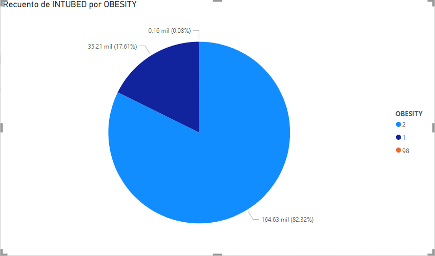

1. La edad en la que muriero mas personas en el covid fue entre 55 años y 75 años por motivo de la intubacion en las UCI.

2. La mayoria de las personas que murieron fue por su obesidad independientemente de su edad.

