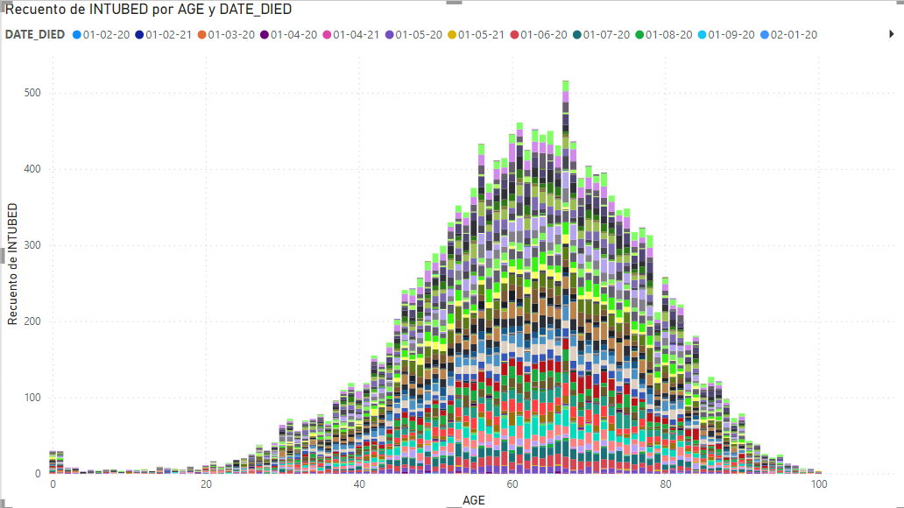
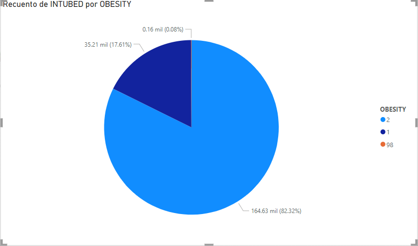
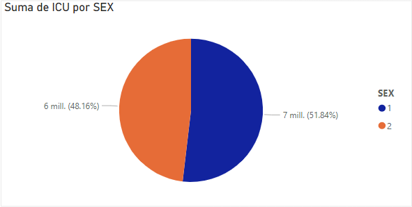
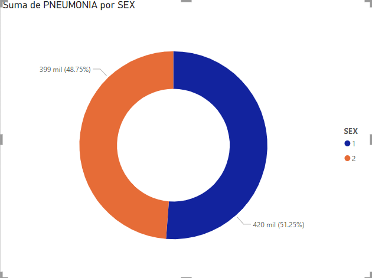
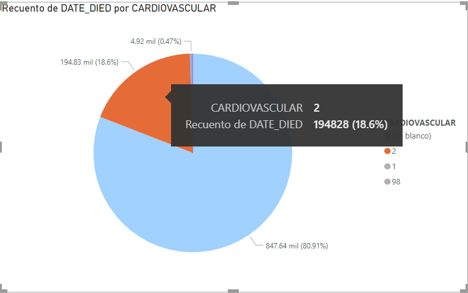
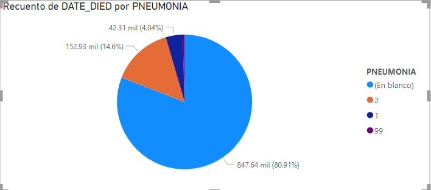
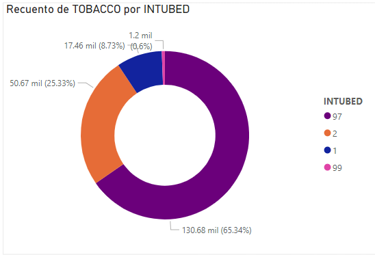
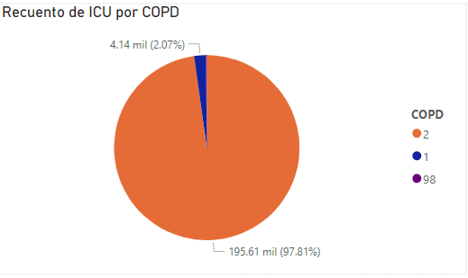
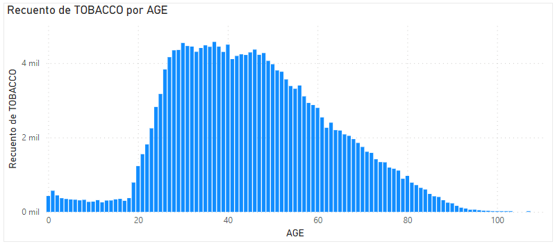

# COVID DATA

## Tema: Salud Mundial

### Este dataset contiene grandes cantidades de datos realacionados a pacientes que obtuvieron ciertas caracteristicas y antecedentes al ingresar a la atencion medica.

### El conjunto de datos sin procesar consta de 21 características únicas y 1.048.576 pacientes únicos. En las características booleanas, 1 significa "sí" y 2 significa "no". valores como 97 en adelante son valores no definidos.

1. La edad en la que muriero mas personas en el covid fue entre 55 años y 75 años por motivo de la intubacion en las UCI.

2. La mayoria de las personas que murieron fue por su obesidad independientemente de su edad.

3. Los hombres fueron los que estuvieron mas veces internadas en la UCI aun asi no tanto como los hombres.

4. Los pacientes que ingresaron tenian neumonia la mayor parte mujeres.

5. El 18.6% no murio porque tenia enfermedad cardiaca en cambio el 0.47% murio teniendo enfermedades cardiacas.

6. El 14.6% que murio no tenia neumonia cuando entro y el 4.04 si la tenia.

7. El 15.79% de los que muerion no tenia diabetes cuando entro al hospital y el 3.28 si la tenia.

8. El 65.34% de los que fumaban tuvieron que ser entubados por riesgo cronicos, en cambio el 25.33% de los que fumaban no fueron entubados.

9. El 97.81 que estuvo en UCI no tenia antes problemas en los pulmones independiente de lo que hayan hecho, en cambio el resto si.

10. Vemos que entre el rango de 20 a 40 años de edad los pacientes tenian antecendentes de fumar tabaco lo cual tenia un mayor indice de riesgo a morir.

