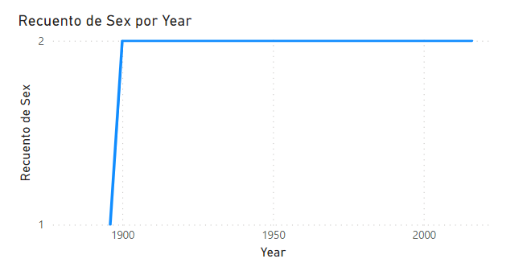
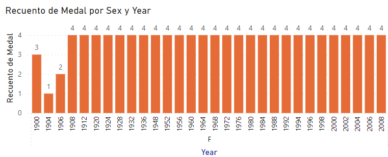
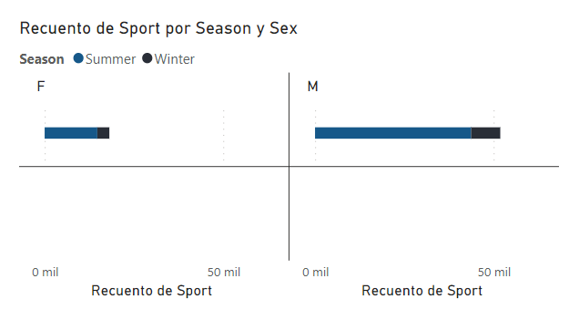

# Conclusiones Olympic Data 🥇 ⛳🥅🏋️‍♀️🚴‍♂️
## Detalle Conclusiones

### 1. Año en el que las mujeres participaron en los juegos olímpicos
|Imagen|
|--|
||
|A partir de este gráfico se puede deducir que desde el año 1990 hasta el 2014 se empezó a tomar en cuenta la participación de las mujeres en los juegos olimpicos, años posteriores a 1990 (1896-1989) la participación era exclusiva de los varones|

### 2. Tipos de medallas obtenidas durante los años (1896-2014) 
|Imagen|
|-|
||
|A partir del siguiente gráfico se observa el recuento de tipo de medallas recibidas tanto para el género femenino como masculino. En el caso del género femenino se observa que desde el año en el que tuvieron participación recibicieron entre sus participantes solamente 3 tipos diferentes de medallas|

### 3. Número de participaciones
|Imagen|
|-|
||
|A partir del siguiente gráfico se observa el número de participaciones en los diferentes deportes tanto para el género femenino en las diferentes temporadas de los juegos olímpicos: Invierno y Verano. Tanto para el femenino como Masculino se observa un mínima participación en la temporada de invierno, al igual que una máxima participación para la temporada de vereno. No obstante, en la participación femenina es menor en comparación a la masculina|