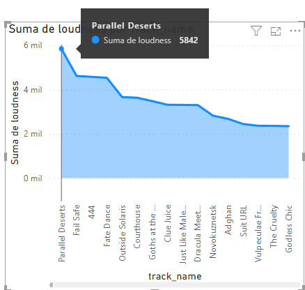
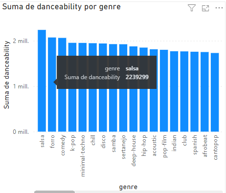

# SPOTIFY DATA

## Tema: 200 mil Canciones de Spotify

### Este dataset contiene un millon de canciones dentro de spotify entre 2012 y 2015

1. El año en el que hay mas canciones dentro de spotify es de 2012 en el cual hubieron un total de 54797 canciones

2. El genero mas escuchado entre 2012 y 2015 es el genero de comedia con un total de 3918 canciones

3. El genero con mas popularidad es el alt-rock con 144096 puntos de popularidad

4. La cancion mas popular es I wanna be yours con un total de 91 puntos

5. La cancion con mayor tempo es Off-Topic con 248221 segundos

6. La cancion que mas impulsa a la persona a la danza es Intro con 37681 puntos 

7. La cancion con mas puntos de energia es Intro con 47515 puntos

8. La cancion con mayor puntos de liveness es Intro con 30500 puntos

9. La cancion con mayor valence es Intro con 30200 puntos

10. La cancion con mayor loudness es Parallel Deserts 5842 puntos

11. El genero con mayor loudness es Songwriter con 62445 puntos

12. El genero con mayor valence es la Salsa con 2708264 puntos

13. El genero que posee mayor energia en sus canciones es black-metal con 2935586 puntos

14. El genero que mas impulsa a la persona a la danza es la Salsa con 2239299 puntos

15. El genero con mayor tempo es el Drump-and-bass con aproxidamente 462 millones de puntos

